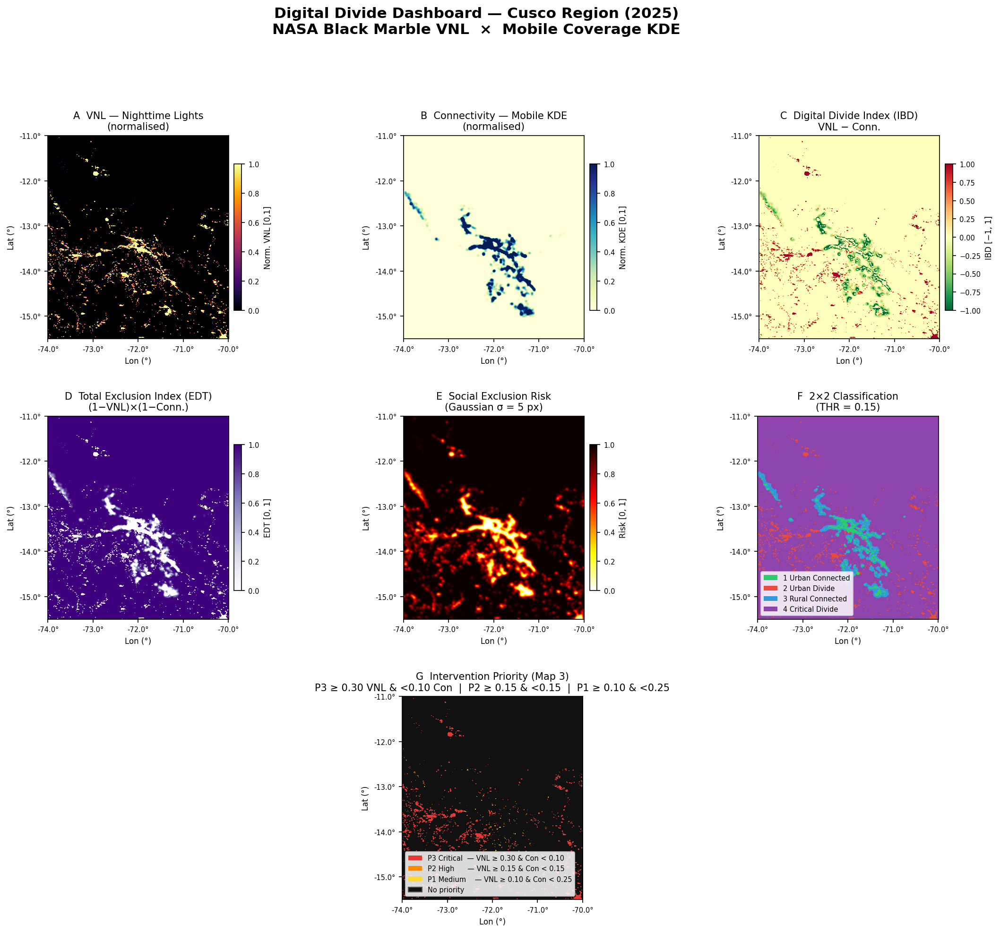

# raster-digital-divide

Geospatial analysis pipeline measuring the territorial digital divide in the Cusco region, Peru, by cross-referencing NASA Black Marble nighttime radiance (VNL) as a proxy for electrification and economic activity, against mobile network kernel density (KDE) as a proxy for connectivity.

---

## Research Question

**Where is the digital divide most acute in the Cusco region, and how does the spatial distribution of nighttime light intensity relate to mobile network coverage?**

The analysis combines two independent raster datasets at a common ~450 m grid to classify every pixel into one of four categories — Urban Connected, Urban Divide, Rural Connected, and Critical Divide — and to derive composite indices that quantify both the intensity and the spatial extent of digital and energy exclusion.

---

## Dashboard Preview



---

## Repository Structure

```
raster-digital-divide/
├── data/
│   ├── VNL_cusco_2025.tif              # NASA Black Marble nighttime radiance (EPSG:4326)
│   └── kernel_cobmovil2019_50m.tif     # Mobile coverage KDE at 50 m (EPSG:32719)
├── notebooks/
│   └── digital_divide_cusco.ipynb      # Main analysis notebook
├── output/
│   ├── vnl_norm.tif                    # Normalised nighttime lights [0, 1]
│   ├── conn_norm.tif                   # Normalised mobile connectivity [0, 1]
│   ├── ibd_brecha_digital.tif          # Digital Divide Index (IBD = VNL − Connectivity)
│   ├── clasificacion_brecha.tif        # 2×2 classification raster (classes 1–4)
│   └── dashboard_brecha_digital.png    # Composite 7-panel figure at 150 dpi
├── README.md
└── requirements.txt
```

---

## Dependencies & Installation

Python 3.10 or later is required. Install all dependencies with:

```bash
pip install -r requirements.txt
```

| Package | Version | Purpose |
|---|---|---|
| `rasterio` | 1.4.3 | Raster I/O, reprojection, and export |
| `numpy` | 2.2.5 | Array operations and normalization |
| `matplotlib` | 3.10.3 | Map rendering and dashboard figure |
| `scipy` | 1.15.3 | Gaussian filter, Pearson correlation, Welch's t-test |
| `seaborn` | 0.13.2 | KDE distribution plots |
| `pandas` | 2.2.3 | Summary tables and descriptive statistics |

---

## How to Run

1. Clone the repository and install dependencies:

```bash
git clone https://github.com/<your-username>/raster-digital-divide.git
cd raster-digital-divide
pip install -r requirements.txt
```

2. Launch Jupyter from the **project root** (the notebook resolves all paths relative to it):

```bash
jupyter notebook notebooks/digital_divide_cusco.ipynb
# or
jupyter lab notebooks/digital_divide_cusco.ipynb
```

3. Run all cells in order: **Kernel → Restart & Run All**.

All output files are written automatically to `output/`. Total runtime is approximately 3–5 minutes, dominated by the KDE reprojection step.

---

## Output Files

| File | Type | Description |
|---|---|---|
| `vnl_norm.tif` | Float32 GeoTIFF | Nighttime radiance normalised to [0, 1] via 2nd–98th percentile stretch. Negative fill values are floored to 0 before scaling. |
| `conn_norm.tif` | Float32 GeoTIFF | Mobile coverage KDE reprojected from EPSG:32719 to EPSG:4326, resampled to the VNL grid, and normalised to [0, 1]. Out-of-extent pixels are set to 0. |
| `ibd_brecha_digital.tif` | Float32 GeoTIFF | Digital Divide Index: `IBD = VNL_norm − Connectivity_norm`. Positive values indicate electrified areas with insufficient connectivity; negative values indicate areas where coverage outpaces light. Range [−1, 1]. |
| `clasificacion_brecha.tif` | UInt8 GeoTIFF | 2×2 classification at threshold 0.15: **1** Urban Connected · **2** Urban Divide · **3** Rural Connected · **4** Critical Divide. NoData = 0. |
| `dashboard_brecha_digital.png` | PNG 150 dpi | Seven-panel composite figure: normalised VNL, normalised connectivity, IBD, total exclusion index (EDT), social exclusion risk, 2×2 classification, and intervention priority map. |

All rasters share the CRS and pixel grid of the source VNL file (EPSG:4326, ~0.0042° ≈ 450 m pixels, 1 081 × 961).

---

## Analysis Pipeline

The notebook is structured in six sequential stages:

1. **Metadata audit** — CRS, shape, resolution, and value range for both input rasters.
2. **Reprojection & alignment** — KDE reprojected to EPSG:4326 and resampled to the VNL grid via bilinear interpolation.
3. **Percentile normalisation** — Both layers clipped to [p2, p98] and scaled to [0, 1].
4. **Index computation** — IBD (Digital Divide Index), EDT (Total Exclusion Index), and Social Exclusion Risk.
5. **Classification** — 2×2 grid at threshold 0.15 and three-tier intervention priority map.
6. **Statistical summary** — Descriptive statistics by class, Pearson correlation, KDE distributions, and Welch's t-test with Cohen's d.

---

## Main Findings

The 2×2 classification reveals that **90.8 % of the Cusco region falls into the Critical Divide category** (low VNL and low connectivity), reflecting the extreme energy and digital poverty of the high-altitude rural Andes. The Pearson correlation between normalised nighttime light and connectivity is moderate (r ≈ 0.35), confirming that while electrified areas tend to have better mobile coverage, the relationship is far from universal — notably, 3.4 % of pixels are classified as Urban Divide, meaning they have significant nighttime light but virtually no mobile signal, representing the most actionable intervention targets. The Welch's t-test comparing VNL between Urban Connected and Critical Divide classes yields a Cohen's d of ≈ 29.8, underscoring that the two groups are structurally separated and that the 0.15 normalisation threshold cleanly discriminates between inclusion and exclusion zones.

---

## Data Sources

| Dataset | Source | Year | Resolution |
|---|---|---|---|
| VNL — Nighttime Radiance | NASA Black Marble (VNP46A4) | 2025 | ~500 m (EPSG:4326) |
| Mobile Coverage KDE | Kernel density of mobile tower locations, Cusco | 2019 | 50 m (EPSG:32719) |
